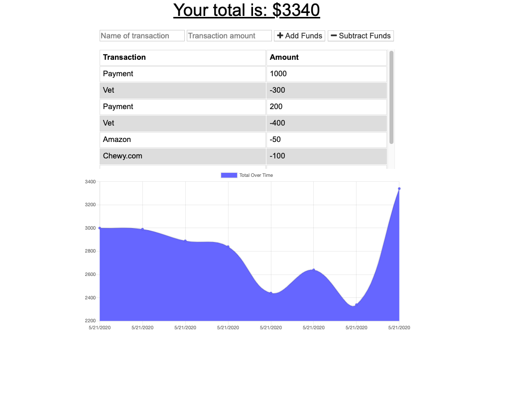

# BudgetTracker

We were provided a functioning Budget Tracker application and tasked with the objective to implement the following functionality: 

Offline Functionality:

  * Enter deposits offline

  * Enter expenses offline

When brought back online:

  * Offline entries should be added to tracker

This application utilized IndexedDB as it's database and was launched with Heroku. 

This assignment used Mongoose, MongoDB, and manipulating a database using a front end application. It was challenging working
with the front end provided, however, I am proud of the functionality I was able to create with my back end work. 

Here is a link to the deployed application: 

https://immense-journey-14942.herokuapp.com/

Here is a link to the GitHub repository: 
https://github.com/laurendoss/BudgetTracker

And finally, here is a screenshot of the deployed app: 
